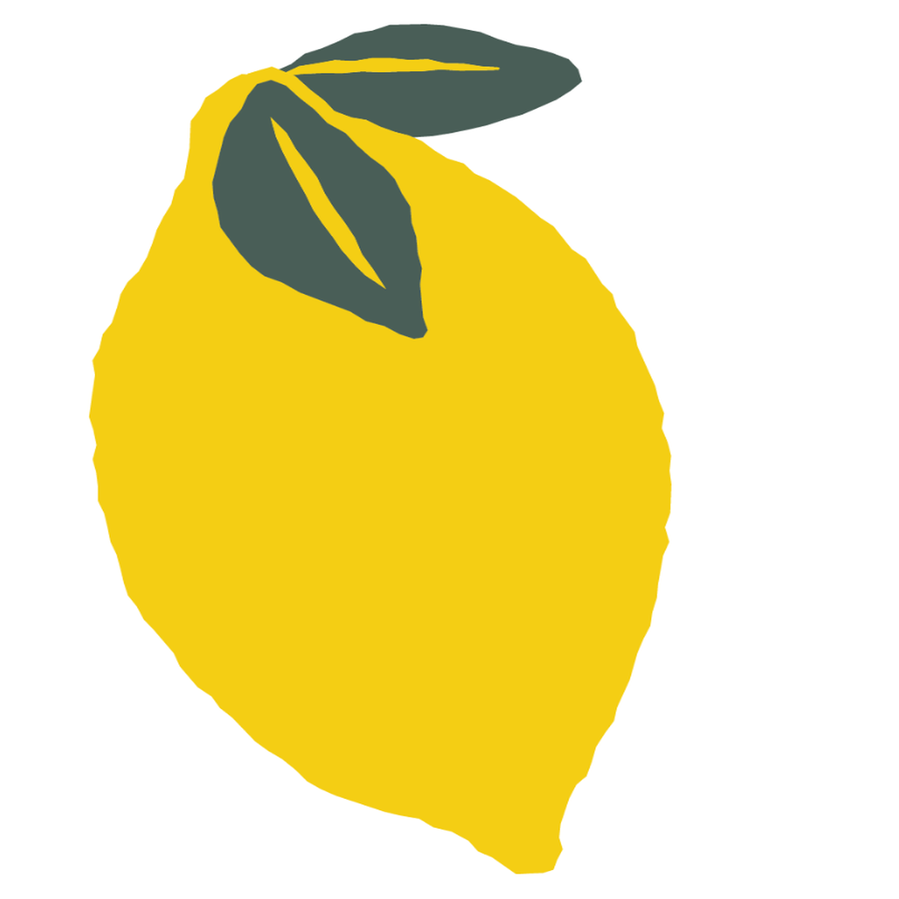

# Little Lemon Food Ordering App

Little Lemon is a food ordering app for a fictional company called Little Lemon, which has all the necessary functionality to order food from a restaurant using pretty user based UI and very smooth navigation between screens.

  

## About

This is the capstone project iOS Mobil app from Meta

This application represents the culmination and demonstration of the skills acquired in my preparation as an iOS Developer. 

During this project, I developed a

Little Lemon Food Ordering App is an online ordering app that has pretty basic functionality and very smooth navigation between screens:

This application starts in an onboarding stage to obtain the basic and essential data of the user (who has the option to register or not).

After the registration process, there is the main view, which takes care of the navigation of the entire application.

The displayed dummy menu information is taken from the web: https://raw.githubusercontent.com/Meta-Mobile-Developer-PC/Working-With-Data-API/main/menu.json, which displays information about each dish, which is immediately saved to the core data and automatically deleted to keep the most up-to-date information.

Likewise, the user has the possibility of filtering, editing, deleting, and updating the dishes on the menu, as well as the option of home delivery or food collection, tips and adding special requests and getting an approximate cost of shipping based on distance and time data using MapKit in real-time. . time. After making the purchase, the user can access the history of the orders created and place new orders.

This application represents the culmination and demonstration of the skills acquired in my preparation as an iOS Developer. During this project, I developed an online food ordering app from scratch for a fictional company called Little Lemon; The development stages of this process include:

- Set up a SwiftUI app with Xcode
- Commit the project to a Git repository (https://github.com/rhencyd/ll)
- Plan and design the UI/UX:
  - User persona (https://www.figma.com/file/koasaX6mALzx8qHeo63Nr3/Persona-RD?node-id=0%3A1&t=eYLuzgMs6T8V5MM3-1)
  - Journey map: https://www.figma.com/file/61scramjcLgnjOiMAqwEUK/Journey-Map-RD?node-id=2%3A38&t=eYLuzgMs6T8V5MM3-1
  - High fidelity prototype: https://www.figma.com/proto/kLdlPrHculQFxEpkHNnb5m/LittleLemonCapstone?node-id=58-162&starting-point-node-id=58%3A162
- Configure the user onboarding UI flow
- Food Menu UI Setting, for this, I have used core data, URL request, and third-party API to get directions to show the map roue

I hope you enjoyed it, and let me know how I can improve it! 

## Privacy Policy

No personal data shared with us will be given to any third party, under any circumstances. Your data will also never be used by us for any purpose without specific permission.

The app engages in no ad targeting, data mining, or other activities that may compromise your privacy, and we do not affiliate ourselves with any third parties that do so.
